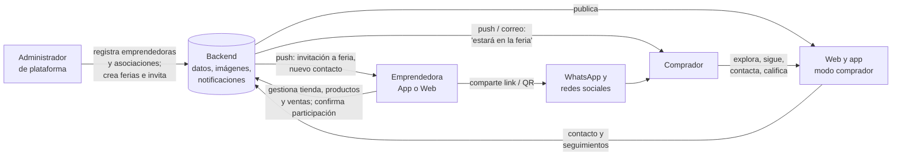

# Ficha de proyecto — Emprendedores Puerto Montt

| Campo | Valor |
|-------|-------|
| Nombre de trabajo | Emprendedores Puerto Montt (el nombre comercial lo propone cada grupo) |
| Asignatura | Programación en Android — proyecto semestral |
| Período | Segundo semestre 2026 (desde Unidad 2 hasta el cierre) |
| Territorio | Comuna de Puerto Montt |
| Contraparte | Asociación de emprendedoras real, vinculada al proyecto de Vinculación con el Medio con centro en Alerce (Puerto Montt) |
| Plataformas | Android (desarrollada en Android Studio) y web |
| Versión de la ficha | 1.1 |
| Fecha | 2026-10-05 (v1.0: 2026-09-28) |
| Estado | Cerrada — base para los requerimientos |

---

## 1. Contexto y problema

En Puerto Montt existen emprendedoras y emprendedores (muchos organizados en asociaciones) que venden productos propios, pero con **bajo nivel de alfabetización digital** y pocos canales para mostrar lo que hacen. Hoy dependen de fotos sueltas en WhatsApp, del boca a boca y, sobre todo, de su presencia en **ferias** y eventos similares, sin un catálogo ordenado, sin control de inventario y sin forma de avisar a sus clientes dónde van a estar.

Al mismo tiempo, quien quiere comprar productos locales no tiene un lugar único donde conocer a las emprendedoras de la comuna, ver lo que ofrecen ni enterarse de cuándo estarán en una feria.

Por su parte, quien organiza ferias (hoy el equipo del proyecto, a futuro la Municipalidad) no cuenta con una herramienta para convocar emprendedoras, saber quién confirmó y difundir el evento.

El problema a resolver tiene tres caras:

- **Para quien vende:** ¿cómo facilitar que una emprendedora con poca experiencia tecnológica publique, ordene y difunda sus productos desde su celular?
- **Para quien compra:** ¿cómo conocer, seguir y encontrar a las emprendedoras de Puerto Montt?
- **Para quien organiza:** ¿cómo convocar y coordinar a las emprendedoras que participan en cada feria o evento?

## 2. Propuesta de solución

Una plataforma que sea **el punto de encuentro del emprendimiento en Puerto Montt**, tanto para vender como para comprar. Tiene tres componentes:

1. **Aplicación móvil Android (una sola app)**
   - **Modo comprador:** explorar emprendedoras, asociaciones y ferias de Puerto Montt; seguir tiendas y asociaciones; recibir avisos. Acceso con cuenta de Google; el administrador define si se permite navegar sin iniciar sesión.
   - **Modo emprendedora:** herramienta principal para administrar su tienda, productos, inventario, ventas, configuración y participación en ferias. Acceso con las credenciales que le entrega el administrador, más huella digital.
   - Se opta por **una sola app** porque publicar y mantener una aplicación en la tienda de Google implica varias etapas de revisión; una app con dos modos simplifica la publicación.
2. **Sitio web** (compatible con computador y teléfono)
   - **Vitrina pública:** directorio de emprendedoras y asociaciones, tiendas, productos y fichas de ferias. Se llega también por link o código QR.
   - **Administración de la tienda:** la emprendedora puede gestionar su tienda desde la web, como alternativa a la app.
   - **Administración de la plataforma:** registro de emprendedoras y asociaciones, gestión centralizada de ferias y eventos, y configuración general.
3. **Backend común:** base de datos, almacenamiento de imágenes, autenticación y notificaciones (push y correo). La IA se incorpora solo si se consiguen fondos (ver 5.4).

## 3. Objetivos

### Objetivo general

Desarrollar una plataforma móvil y web que sea el punto de encuentro del emprendimiento en Puerto Montt, permitiendo a emprendedoras y asociaciones gestionar y difundir sus productos, a los compradores conocerlas, seguirlas y enterarse de su presencia en ferias, y al administrador coordinar centralizadamente las ferias y eventos.

### Objetivos específicos

1. Permitir que un administrador de plataforma registre emprendedoras individuales y asociaciones (registro no libre).
2. Dar acceso seguro a cada perfil: emprendedoras con usuario, contraseña y huella; compradores con cuenta de Google en la app y con cualquier medio habilitado en la web; con navegación anónima configurable en la app.
3. Facilitar la creación de fichas de producto (foto, nombre, descripción, precio, disponibilidad) con un flujo guiado y amigable, desde la app o la web, respetando las particularidades de productos artesanales (a pedido, piezas únicas, variantes, stock opcional), con configuraciones aplicables por producto o masivamente.
4. Permitir a la emprendedora registrar sus ventas y, si lo desea, llevar un historial privado de ellas.
5. Permitir compartir la tienda, cada producto, cada asociación y cada feria mediante link (WhatsApp, redes sociales) y código QR.
6. Ofrecer a los compradores un directorio de emprendedoras, asociaciones y ferias de Puerto Montt, en app y web.
7. Permitir que los compradores con cuenta sigan tiendas y asociaciones y reciban avisos (push o correo) cuando participen en una feria.
8. Gestionar ferias y eventos de forma centralizada: creación, invitación de emprendedoras, confirmación de participación, seguimiento tipo checklist y ficha pública del evento.
9. Ofrecer funcionalidades configurables por emprendedora: precios visibles, calificaciones, forma de contacto, notificaciones con horario, historial de ventas y valores por defecto de productos.
10. Levantar y modelar los tipos de emprendimiento y de producto reales de la contraparte.
11. Ubicar las ferias en un mapa y, con permiso del usuario, mostrar las ferias cercanas a su posición (GPS).
12. Construir la plataforma con prácticas profesionales: flujo de trabajo en Git, base de datos documentada y pruebas de seguridad con su informe.
13. *(Condicionado a financiamiento)* Incorporar asistencia de IA que evalúe y sugiera mejoras a la ficha del producto.

## 4. Actores y perfiles de usuario

| Perfil | Descripción | Canal | Acceso |
|--------|-------------|-------|--------|
| Administrador de plataforma | Perfil de usuario con permisos globales. Registra emprendedoras y asociaciones, administra las asociaciones, crea ferias y eventos, invita y hace seguimiento. Mantiene catálogos base y la configuración general. En esta etapa es el equipo del proyecto; a futuro, la Municipalidad de Puerto Montt. | Web | Cuenta asignada |
| Emprendedora | Usuaria principal que vende. Gestiona su tienda, productos, inventario, ventas y configuración; confirma su participación en ferias. Baja experiencia tecnológica. Registrada por el administrador. | App Android (principal) y web | Usuario y contraseña entregados por el administrador; huella en la app |
| Comprador | Persona que quiere conocer y comprar. Para seguir, recibir notificaciones y calificar necesita una cuenta. | App Android (modo comprador) y web | App: solo cuenta de Google. Web: cualquier medio habilitado (Google, correo y contraseña, etc.) |
| Visitante sin cuenta | Persona que navega sin iniciar sesión. Puede ver tiendas, productos y ferias, pero no seguir, pedir alertas ni calificar. | Web (siempre) y app (si el administrador lo permite) | Sin cuenta |

Las **asociaciones** no son un perfil de usuario: son entidades administradas solo por el administrador de plataforma.

## 5. Alcance funcional (primera versión)

### 5.1 Registro y acceso

- **El registro de emprendedoras no es libre:** nadie puede registrarse por sí mismo como emprendedora ni como asociación. Lo hace el administrador de plataforma.
- La emprendedora recibe sus credenciales e inicia sesión con usuario y contraseña; en la app puede activar el acceso con huella digital después del primer ingreso.
- **Comprador en la app:** el único medio de acceso en Android es la cuenta de Google.
- **Comprador en la web:** puede crear cuenta o ingresar con cualquier medio habilitado (Google, correo y contraseña, u otros).
- Recuperación de contraseña para emprendedoras y compradores con correo y contraseña.

**Navegación anónima**

| Canal | Comportamiento |
|-------|----------------|
| App (modo comprador) | **Configurable por el administrador de plataforma**, con tres opciones: (a) permitir navegación anónima; (b) permitirla, pero invitar a iniciar sesión con Google al abrir la app, con opción de omitir; (c) no permitirla y obligar el inicio de sesión con Google al abrir la app. |
| Web | Navegación anónima siempre permitida; la web **no** obliga a iniciar sesión al entrar. |

En ambos canales, cuando alguien que navega de forma anónima intenta **seguir** a una emprendedora o asociación, **pedir alertas** o **calificar**, la acción se bloquea y se le pide iniciar sesión o registrarse (en la app, con Google). Una vez autenticado, la acción continúa.

### 5.2 Tienda de la emprendedora

- Ficha de tienda: nombre, foto o logo, descripción, tipo de emprendimiento, sector de Puerto Montt, datos de contacto (WhatsApp, redes) y, si ella lo desea, un punto de venta o retiro marcado en un mapa.
- Pertenencia opcional a una o más asociaciones (la asigna el administrador).
- Administrable desde la app y desde la web.

### 5.3 Catálogo, inventario y ficha de producto

Cada emprendedora tiene **una tienda con un catálogo** que reúne todos sus productos. Los productos son mayormente **artesanales**, por lo que el inventario no funciona como en una tienda tradicional: la ficha de producto debe representar cómo se produce y se vende cada cosa.

**Principio:** cada emprendedora maneja su catálogo como le acomode. Por eso, el comportamiento de cada producto (stock, variantes, qué pasa al agotarse, visibilidad) **es configurable por la emprendedora**, y cada configuración se puede aplicar **por producto** o **masivamente** (a varios productos seleccionados, a una categoría o a todo el catálogo).

**Datos comunes de la ficha:** fotos, nombre, descripción, categoría, precio, tipo de producto y configuración de disponibilidad.

**Variantes:**

- Un producto puede tener **variantes** (por ejemplo talla, color, tamaño) o ser un producto **sin variantes**.
- Cada variante puede tener su **propio precio** y su **propia foto**.
- Si el producto maneja stock, cada variante lleva su propio stock.
- En la vista del comprador, al seleccionar una variante se muestran su foto y su precio.

**Configuración de disponibilidad de cada producto:**

| Configuración | Opciones | Efecto en el catálogo público |
|---------------|----------|-------------------------------|
| Modalidad | **Regular** (hecho, listo para vender) · **A pedido** (se fabrica por encargo) · **Pieza única** (un solo ejemplar, no reemplazable) | "A pedido" aparece identificado como tal. La pieza única aparece hasta venderse; al venderse **no vuelve** al catálogo. |
| Manejar stock | Sí · No | Con stock, cada venta registrada descuenta unidades. Sin stock, el producto aparece mientras esté disponible, sin contar unidades. |
| Al agotarse (solo con stock) | Mostrar como "agotado" · Ocultar del catálogo · Pasar a "a pedido" | Define qué ve el comprador cuando el stock llega a cero. |
| Visibilidad | Disponible · No disponible | "No disponible" conserva el producto en su tienda pero **deja de aparecer** en el catálogo público. |

**Operaciones:**

- Crear, editar y eliminar productos.
- Seleccionar varios productos (o una categoría, o todo el catálogo) y aplicarles una configuración de una vez.
- Registrar una venta (ver "Registro de ventas").
- Flujo guiado paso a paso: sacar foto → datos básicos → variantes (si tiene) → disponibilidad → revisión de IA (solo si está habilitada) → publicar.

**Valores por defecto:** cada emprendedora define en su tienda la configuración con que nace un producto nuevo (modalidad, manejo de stock, comportamiento al agotarse, visibilidad). Así el flujo de creación no le pregunta todo cada vez; solo cambia lo que difiere en ese producto. La plataforma entrega una configuración inicial que ella puede modificar.

**Registro de ventas:**

- La venta ocurre fuera de la plataforma (en persona, en ferias, por WhatsApp); la emprendedora la **registra** en la app o la web.
- Al registrar una venta se descuenta el stock (del producto o de la variante) y, si es pieza única, se retira del catálogo.
- **Historial de ventas opcional:** la emprendedora decide si quiere guardar su historial. Si lo activa, cada venta queda registrada con producto, variante, cantidad, precio, fecha y lugar (una feria de la plataforma u otro lugar), para que después pueda revisar **qué vendió, dónde, cuándo y en qué feria**.
- El historial es **privado**: solo lo ve la emprendedora. El administrador de plataforma no tiene acceso a él.
- Si está confirmada en una feria que ocurre ese día, la app sugiere esa feria como lugar de la venta.

**Cuidado con la ficha de producto:** la plataforma debe resolver tipos de producto muy distintos (alimentos, textiles, cerámica, plantas, cosmética, etc.), cada uno con campos propios. Esos tipos y sus campos **deben levantarse** con la contraparte antes de cerrar el diseño (ver 5.11). El modelo propuesto es: campos comunes + variantes + configuración de disponibilidad + campos específicos según el tipo de producto.

### 5.4 Asistencia con IA (condicionada a financiamiento)

- La IA es **opcional y depende de conseguir fondos**. Sin fondos, no hay IA: **la plataforma debe funcionar completa sin ella**.
- El diseño debe permitir incorporarla después sin rehacer el flujo de creación de productos; se habilita o deshabilita desde la configuración de la plataforma.
- Si se habilita, a partir de la foto y los datos la IA evalúa la ficha y sugiere: mejor título, descripción más atractiva, categoría y observaciones sobre la calidad de la foto (luz, fondo, encuadre). **No sugiere precios.**
- La emprendedora siempre decide si acepta o no la sugerencia.

### 5.5 Compartir

- Compartir la tienda, un producto, una asociación o una feria por WhatsApp y redes sociales (menú nativo de Android) con un link a la versión web.
- Generar un código QR de la tienda, de la asociación o de la feria (para imprimir y llevar al evento, por ejemplo).

### 5.6 Ferias y eventos (gestión centralizada)

**Principio:** las ferias y eventos los crea y administra **exclusivamente el administrador de plataforma**. La emprendedora **no puede crear ferias ni eventos**; solo responde si participa. La participación es **solo por invitación**: no hay postulación abierta.

**Gestión del administrador:**

- Crear, editar, publicar y cancelar ferias o eventos (calendario centralizado).
- Invitar emprendedoras y asociaciones a una feria; enviar recordatorios.
- Agregar directamente a una emprendedora o asociación a la feria.
- **Checklist por feria**, fácil de encontrar y navegar, con el estado de cada emprendedora o asociación:

| Estado | Significado |
|--------|-------------|
| Invitada | Se envió la invitación, sin respuesta aún. |
| Confirmada | La emprendedora marcó que participa. |
| Rechazada | La emprendedora marcó que no participa. |
| Agregada por el administrador | Incorporada directamente, sin invitación. |
| Asistió / No asistió | Registro de la asistencia real el día de la feria. |

- Filtros y búsqueda dentro del checklist (por estado, tipo de emprendimiento, asociación) y acciones rápidas: notificar a las que no han respondido, notificar a las confirmadas.

**Participación de la emprendedora:**

- Recibe la invitación como notificación en la app.
- Marca "Participo" o "No participo" con un solo toque.
- Ve en su app el calendario de ferias a las que está invitada o confirmada.

**Ficha pública de la feria (web y modo comprador):**

- Nombre, descripción, imagen, lugar, fecha y horario, organizador.
- Mapa con la ubicación de la feria y opción "Cómo llegar" (abre la aplicación de mapas del celular). El administrador marca la ubicación en un mapa al crear la feria.
- Emprendedoras y asociaciones que asistirán, con acceso a su tienda y una muestra de su catálogo público (solo lo que el comprador puede ver según la configuración de cada producto).
- Link y QR para compartir la feria.
- Al confirmarse la participación de una emprendedora o asociación, se avisa a sus seguidores.

### 5.7 Experiencia del comprador (app y web)

- Navegación anónima según lo definido en 5.1 (web siempre; app según configuración del administrador).
- Directorio de emprendedoras y asociaciones de Puerto Montt, con búsqueda y filtros (tipo de emprendimiento, sector, asociación).
- Vista de tienda, detalle de producto, vista de asociación y calendario de próximas ferias con su ficha.
- Mapa de próximas ferias; si la persona autoriza su ubicación (GPS), el mapa se centra en su posición y las ferias se ordenan por distancia.
- Contacto con la emprendedora según la forma que ella configuró.
- Calificaciones, en las tiendas que las tengan activas (requiere cuenta).
- **Seguir** una tienda o una asociación (requiere cuenta):
  - En la app, con la cuenta de Google; los avisos llegan como notificación push.
  - En la web, con la cuenta del comprador; los avisos llegan como notificación del navegador (la web solicita el permiso) o por correo.
  - En esta primera versión, los seguidores reciben avisos **solo de participación en ferias**.
- Web adaptable: funciona bien en computador y en teléfono.

### 5.8 Funcionalidades configurables por emprendedora

**Configuraciones de la tienda:**

| Configuración | Qué controla |
|---------------|--------------|
| Mostrar precios | Si los precios se ven en la web y en el modo comprador (si no, se muestra "consultar precio"). |
| Calificaciones | Si los compradores pueden calificar la tienda y sus productos. |
| Forma de contacto | Cómo la contactan: WhatsApp directo, formulario de contacto, o ambos. |
| Notificaciones de contacto | Si recibe en la app un aviso cuando alguien la contacta por formulario, y en qué **horario**. Fuera de horario, el contacto queda guardado para verlo después en la app, pero no suena. |
| Historial de ventas | Si guarda el historial de las ventas que registra (qué, dónde, cuándo, en qué feria), o solo descuenta stock. El historial es privado. |
| Valores por defecto de productos | Configuración con que nace cada producto nuevo. |

**Configuraciones de producto** (aplicables por producto o masivamente, detalle en 5.3): modalidad, manejo de stock, comportamiento al agotarse, visibilidad y variantes (con precio, foto y stock propios).

### 5.9 Asociaciones

- Registradas y administradas **solo por el administrador de plataforma**.
- Ficha de asociación: nombre, logo, descripción, sector, contacto, integrantes.
- Una emprendedora puede pertenecer a **más de una** asociación.
- Vista web y en modo comprador, con acceso a cada tienda integrante.
- Link, QR y seguidores propios; aviso a sus seguidores de las ferias en que participa como asociación.

### 5.10 Administración de la plataforma (web)

- Registro, edición y desactivación de emprendedoras y asociaciones.
- Asignación de emprendedoras a asociaciones.
- Gestión de ferias y eventos con su checklist (ver 5.6).
- Gestión de perfiles de administrador (para traspasar la operación a la Municipalidad).
- Configuración general de la plataforma: navegación anónima en la app (ver 5.1) y habilitación de la IA (ver 5.4).
- Mantención de tipos de emprendimiento, tipos de producto y categorías.

### 5.11 Tipos de emprendimiento y tipos de producto

Parte del trabajo es **levantar** con la asociación contraparte en Alerce:

1. Los **tipos de emprendimiento** reales.
2. Los **tipos de producto** de cada emprendimiento, con los campos que necesita su ficha, las variantes habituales y la modalidad de disponibilidad más común (regular, a pedido, pieza única).

Lista preliminar de tipos de emprendimiento (hipótesis, a validar en terreno):

- Alimentos y repostería (productos perecibles, por encargo).
- Artesanía y manualidades (textil, cerámica, madera, tejido).
- Vestuario y accesorios.
- Cosmética natural y cuidado personal.
- Plantas, huerta y productos agrícolas.

Cada tipo puede requerir campos distintos (ej. alimentos: ingredientes, alérgenos; vestuario: tallas y colores).

**Servicios** (peluquería, costura, clases, etc.): no se incluyen en la primera versión, **salvo que el levantamiento muestre que son necesarios** para la contraparte.

## 6. Fuera de alcance

- Aplicación para iOS: el proyecto se desarrolla en Android Studio; quien use iPhone accede por la web.
- Creación de ferias o eventos por parte de las emprendedoras.
- Postulación abierta a ferias: la participación es solo por invitación del administrador.
- Autoregistro de emprendedoras o asociaciones.
- Pagos en línea y carrito de compras (las ventas ocurren fuera de la plataforma y la emprendedora las registra).
- Gestión de despachos o logística.
- Chat en tiempo real dentro de la plataforma; el contacto se hace por WhatsApp o formulario.
- Avisos a seguidores distintos de la participación en ferias (productos nuevos, ofertas).
- Sugerencia de precios por IA.
- Servicios, salvo que el levantamiento indique lo contrario.
- Territorios fuera de la comuna de Puerto Montt.

## 7. Supuestos y restricciones

- La emprendedora usa un celular Android de gama media o baja, posiblemente con conexión inestable.
- Diseño orientado a baja alfabetización digital: pocos pasos por pantalla, botones grandes, íconos con texto, lenguaje simple, confirmaciones claras, posibilidad de volver atrás sin perder datos.
- El comprador en Android tiene una cuenta de Google (requisito habitual del dispositivo).
- La web debe ser adaptable (computador y teléfono); muchos compradores llegarán desde WhatsApp o un QR en el celular.
- Las notificaciones web dependen de que el navegador las soporte y de que el comprador acepte el permiso; por eso existe la alternativa del correo.
- Las herramientas del administrador deben ser simples de operar, porque la operación se traspasará a la Municipalidad.
- La IA depende de conseguir financiamiento; la plataforma no puede depender de ella.
- Los datos personales de emprendedoras y compradores deben tratarse según la normativa chilena de protección de datos, con consentimiento explícito para notificaciones y opción de dejar de seguir o darse de baja.
- La ubicación del celular se pide solo cuando una función la necesita; si se rechaza, la app sigue funcionando, y la ubicación de la persona no se guarda en el servidor.

## 8. Propuesta tecnológica tentativa

Se define en la etapa de diseño; esta es la propuesta inicial.

| Capa | Opción propuesta |
|------|------------------|
| App móvil | Kotlin + Jetpack Compose (Android Studio) |
| Biometría | AndroidX Biometric (`BiometricPrompt`) |
| Autenticación | Firebase Authentication: Google (compradores en app y web), correo y contraseña (emprendedoras y compradores web), cuentas de emprendedora creadas por el administrador |
| Datos | Cloud Firestore |
| Imágenes | Cloud Storage for Firebase |
| Notificaciones push (app y web) | Firebase Cloud Messaging |
| Correo | Servicio de envío de correos (por definir) |
| Web | Framework web adaptable (por definir) + Firebase Hosting |
| QR | Generación en la app (ej. ZXing) |
| Mapas y ubicación | Maps SDK for Android (Maps Compose) y Fused Location Provider en la app; Maps JavaScript API en la web |
| Seguridad | Reglas de seguridad probadas con Firebase Emulator Suite, Firebase App Check, análisis con Android Lint y MobSF |
| Versionado | Git con ramas por funcionalidad, *pull requests*, *issues* y etiquetas por entrega |
| IA (si hay fondos) | Gemini (vía Firebase AI Logic) |

Se aprovecha lo trabajado con Firebase en la Unidad 1.

## 9. Organización del trabajo

- **Cada grupo de estudiantes construye la plataforma completa.**
- El equipo docente entrega los [requisitos base](requerimientos-base.md); **cada grupo realiza el levantamiento** con la contraparte ([pauta de levantamiento](pauta-levantamiento.md)) y completa los requisitos con lo que obtenga.
- **Cada grupo propone el nombre comercial** e identidad visual de su plataforma.
- Al final del semestre se elige la mejor solución; el **grupo ganador presenta su plataforma a las emprendedoras** y es la base de la implementación final.
- En la solución ganadora, el registro real de emprendedoras, asociaciones y ferias lo hace el equipo del proyecto como administrador de plataforma; más adelante podría asumirlo la Municipalidad.

## 10. Riesgos iniciales

| Riesgo | Mitigación |
|--------|------------|
| Alcance demasiado grande para un semestre | Priorizar un producto mínimo y definir entregas incrementales. |
| Diseño poco usable para usuarias con baja tecnología | Validar prototipos con la asociación contraparte antes de programar. |
| Una sola app con dos modos confunde a las usuarias | Separar claramente la entrada de comprador y la de emprendedora desde la primera pantalla. |
| No se consiguen fondos para la IA | La plataforma funciona completa sin IA; la IA se diseña como módulo que se habilita después. |
| Tipos de producto muy distintos entre sí (fichas que no calzan) | Levantamiento previo con la contraparte; modelo con campos comunes + variantes + configuración de disponibilidad + campos específicos por tipo. |
| Inventario desactualizado (piezas vendidas que siguen publicadas) | Registrar la venta con un solo toque desde la app; recordatorios de revisión del catálogo. |
| Demasiadas configuraciones para usuarias con baja tecnología | Valores por defecto definidos por la propia emprendedora, configuración masiva y opciones avanzadas fuera del flujo básico de creación. |
| Datos personales expuestos en la web | Definir qué datos son públicos; consentimiento explícito en seguimientos. |
| Notificaciones no entregadas (permisos, spam) | Ofrecer push y correo; permitir dejar de seguir fácilmente. |
| Herramientas de administración difíciles para la Municipalidad | Diseñar el checklist y el calendario pensando en operadores no técnicos. |
| Dependencia de la disponibilidad de la contraparte | Coordinar las visitas de levantamiento y validación con Vinculación con el Medio. |

## 11. Hitos del semestre

Las fechas y el contenido de cada entrega semanal están en la [planificación](planificacion.md).

| Hito | Contenido | Entregas |
|------|-----------|----------|
| H1 — Definición | Ficha de proyecto y requisitos base (docentes). Diseño conceptual, nombre comercial y propuesta (prototipo) para revisar con las emprendedoras (cada grupo). Visita a Alerce el miércoles 14 de octubre. | 1 y 2 (5 y 14 oct) |
| H2 — Diseño | Informe de levantamiento, requisitos completos, modelo de datos, arquitectura y prototipo corregido con la retroalimentación de la asociación. | 3 (19 oct) |
| H3 — Base | Perfiles y acceso (administrador, emprendedora con huella, comprador con Google), registro de emprendedoras y asociaciones, ficha de tienda, catálogo con variantes y configuración de disponibilidad. | 4 y 5 (26 oct y 2 nov) |
| H4 — Difusión | Web pública y modo comprador, links, QR, compartir, ferias en el mapa y GPS. | 6 (9 nov) |
| H5 — Ferias y valor agregado | Ferias con checklist e invitaciones, ficha de feria, seguidores y notificaciones, registro e historial de ventas, configuraciones de tienda, calificaciones, contacto. IA solo si hay fondos. | 7 (16 nov) |
| H6 — Cierre | Pruebas, ajustes de usabilidad y entrega final. Luego, selección del grupo ganador y presentación a las emprendedoras. | 8 (23 nov) |

## 12. Decisiones tomadas en la definición

| Tema | Decisión |
|------|----------|
| Territorio | Solo la comuna de Puerto Montt. |
| Aplicación | Una sola app Android con modo comprador y modo emprendedora. |
| Registro | No libre: el administrador registra emprendedoras y asociaciones. |
| Acceso del comprador | App: solo Google, con navegación anónima configurable (tres opciones). Web: cualquier medio, navegación anónima siempre permitida. |
| Acciones con cuenta | Seguir, pedir alertas y calificar requieren cuenta. |
| Asociaciones | Administradas solo por el administrador; una emprendedora puede estar en varias. |
| Ferias | Centralizadas, solo por invitación, con checklist (incluye asistencia) y ficha pública con mapa de ubicación. |
| Producto | Modalidad, stock, comportamiento al agotarse, visibilidad y variantes configurables por producto o masivamente; valores por defecto definidos por la emprendedora. |
| Ventas | Registradas por la emprendedora; historial opcional y privado. |
| Avisos a seguidores | Solo participación en ferias en la primera versión. |
| Contacto | Configurable (WhatsApp, formulario o ambos); fuera de horario queda guardado. |
| IA | Condicionada a financiamiento; sin fondos no hay IA. Si se habilita, no sugiere precios. |
| Servicios | Fuera de la primera versión, salvo que el levantamiento los sugiera. |
| Organización | Cada grupo construye la plataforma completa; el ganador la presenta a las emprendedoras. |
| Requisitos | Los docentes proponen los requisitos base; cada grupo levanta y agrega el resto. |
| Nombre comercial | Lo propone cada grupo. |
| Mapas y GPS (v1.1) | Ubicación de ferias en el mapa, mapa de ferias cercanas con permiso de ubicación y punto de venta opcional de la emprendedora. |
| Evaluaciones (v1.1) | Los contenidos evaluados en la asignatura (Git, base de datos, seguridad, GPS y mapas, presentación final) se incluyen como requisitos del proyecto; ver la [planificación](planificacion.md). |

## 13. Próximos pasos

1. Cada grupo prepara su diseño conceptual (entrega del 5 de octubre) y su propuesta para la visita según la [planificación](planificacion.md).
2. Visita a la asociación de Alerce el miércoles 14 de octubre: cada grupo llega con su propuesta (entrega 2), aplica la [pauta de levantamiento](pauta-levantamiento.md) y revisa la propuesta con las emprendedoras.
3. Cada grupo entrega su informe y completa los [requisitos base](requerimientos-base.md) con los hallazgos del levantamiento (entrega del 19 de octubre).
